# Как пользоваться ветками в проекте и для чего они нужны

1. Давайте посмотрим, на какой ветке мы сейчас находимся и сколько у нас веток на данный момент. Выполните команду `$ git branch` и вы увидите следующий результат  
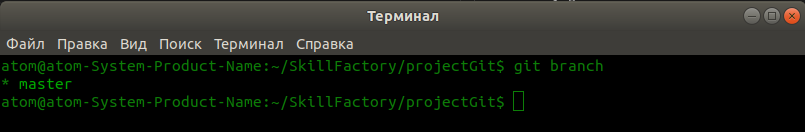  
Видим, что мы находимся на ветке "* **master**" о чем свидетельствует звездочка вначале строки перед словом **master**.  
2. К примеру, есть еще одни разработчик, который с Вами будет работать над данным проектом и он должен добавить файл описания проекта в формате **.md**. Для этой задачи, он должен работать в другой ветке, чтобы не мешать процессу разработки проекта и в своей ветке, заниматься поставленной задачей. Давайте разберемся как это сделать?  
3. Для создания новой ветки, нам нужно выполнить следующую команду `$ git branch devone`. Сама команда `$ git branch`, а **devone**, это название новой ветки. На самом деле, она может называться как угодно. Выполните команду `$ git branch devone` и `$ git branch` и вы увидите следующий результат.  
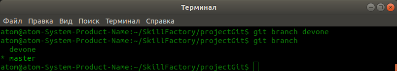  
Видим, что мы на данный момент находимся на ветке "* **master**", но появилась новая ветка, которая называется **devone**.  
4. Мы можем удалить ветку, для этого выполним команду `$ git branch -D devone` и далее выполним команду `$ git branch`, чтобы проверить, что ветка удалена. После выполнения получаем следующий результат.  
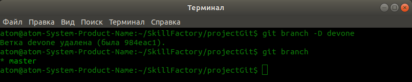  
В консоли нам сообщается, что ветка удалена, но мы использовали команду `$ git branch`, чтобы вывести все ветки и увидеть, что есть только ветка "* **master**", одна единственная. Если после создания ветки, она Вам больше не нужна, то можете таким образом ее удалить.  
5. Давайте вернем ветку, выполнив команду `$ git branch devone` и начнем использовать ветку.  
Если после создания ветки **devone**, мы выполним команду `$ git branch`, то увидим, что есть ветка **devone**, но мы находимся на ветке "* **master**", так как именно она помечена звездочкой.  
6. Давайте переключимся на ветку **devone**, для чего выполним команду `$ git checkout devone` и сразу выполним команду `$ git branch`, получив следующий результат.   
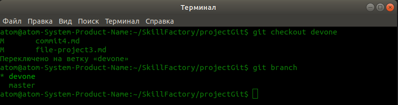
Теперь мы видим, что звездочка, стоит перед название ветки "* **devone**", а это значит, что мы находимся в ветке "* **devone**" и можем в ней работать.  
7. Можно создать ветку и сразу на нее переключиться. Это можно сделать командой `$ git checkout -b new-branch`, далее выполним команду `$ git branch` и получаем следующий результат.  
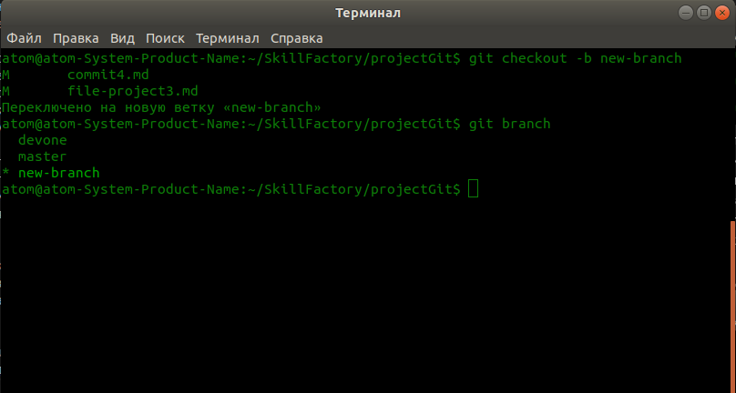  
Видим, что появилась новая ветка "* **new-branch**", на которую мы сразу после создания, были переключены, о чем свидетельствует звездочка вначале строки.  
8. Давайте удалим ветку "* **new-branch**" и переключимся на ветку "**devone**". Для этого выполним две команды `$ git checkout devone` и следом `$ git branch -D new-branch`, чтобы удалить ветку "**new-branch**", и чтобы увидеть полный результат, выполняем команду `$ git branch`. В консоли мы увидим следующую информацию.  
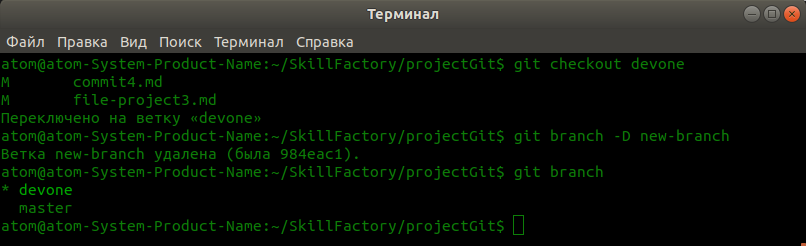  
Видим, что ветка "**new-branch**" удалена, ее больше нет в списке, а мы находимся на ветке "* **devone**".  
9. Давайте поработаем в ветке "* **devone**". Для чего создадим в корне проекта файл **one.js**, и далее выполним команду `$ git status`. Получим следующий результат.  
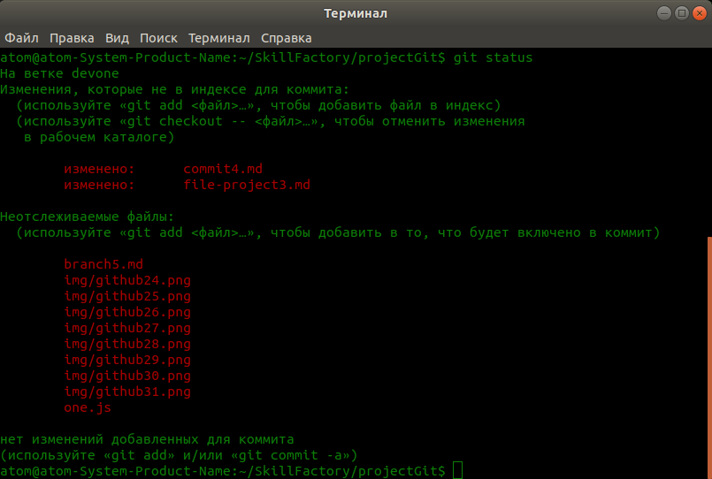  
Как видите, за время пока я был переключен не ветку "* **devone**", было изменено 2 файла и добавлено 10 новых файлов, которые на данный момент не отслеживаются.  
10. Давайте выполним команду `$ git add .`, чтобы Git начал отслеживать файлы. После выполним команду `$ git status` и получим следующий результат.  
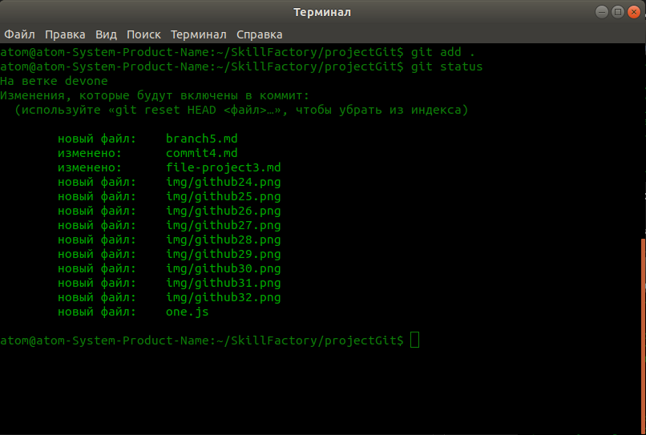  
Как видим, новые и измененные файлы, при работе в ветке "* **devone**", теперь отслеживаются и будут включены в коммит.  
11. Давайте сделаем коммит, выполнив команду `$ git commit -m "add file one.js"`. После запустим команду `$ git status` и получим следующее сообщение в консоли, что на ветке "* **devone**", комитить нечего.  
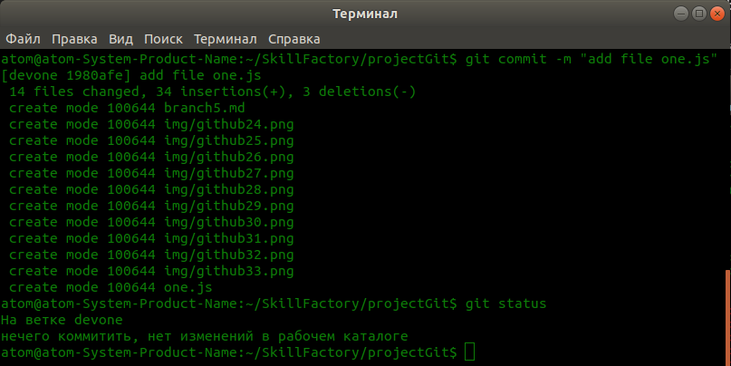  
12. Теперь мы должны понять, что у нас есть две ветки, в каждой мы работаем и в каждой ветке, производим свои изменения, которых нет в другой ветке. В ветке "* **devone**" у нас добавлены и изменены свои файлы, а в ветке **master**, также добавлены и изменеы другие файлы.  
13. Если Вы работаете в редакторе кода VsCode, то слева в столбце, у Вас будут видны файлы проекта. Обратите внимание, что при переключении на другую ветку, количество файлов и сами файлы будут меняться, так как мы говорили с Вами, что в разных ветках, изменены разные файлы и файлы которые есть в одной ветке, отсутствуют в другой.  
<<<<<<< HEAD
14. И так, давайте выполним команду `$ git checkout master`  
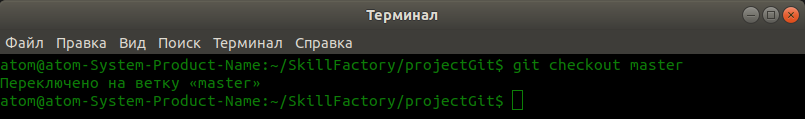    
но перед этим обратим внимание на левый столбец и увидим какие в нем есть файлы, у меня на ветке "* **devone**", список файлов выглядит как на сриншоте.  
Ниже на скриншоте, Вы видите список файлов на ветке "* **devone**"
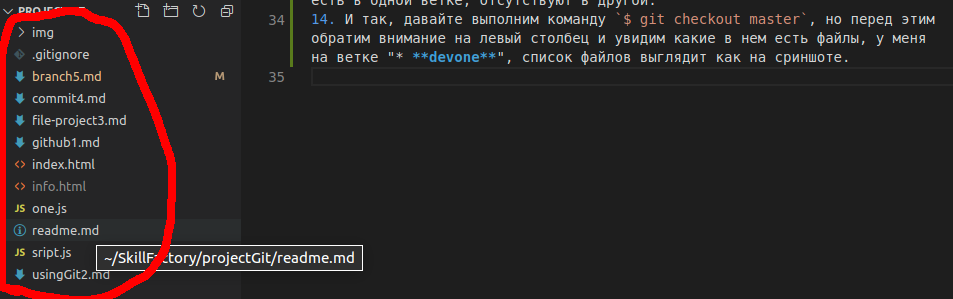  
После выполнения команды `$ git checkout master`, список файлов меняется, так как мы будем видеть файлы, из ветки "* **master**", на которую мы переключились.  
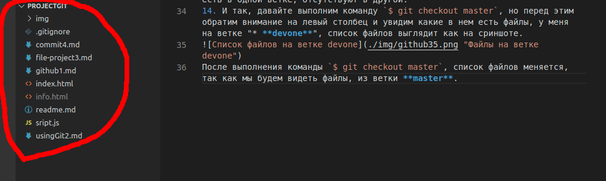  
Как видите список файлов на ветках, будет отличаться. То есть на одной ветке, у нас одна версия проекта, а другой ветке, другая версия проекта, которые могут разрабатываться параллельно и абсолютно ничего не знать друг про дгура.  
14. И так, давайте выполним команду `$ git checkout master`, но перед этим обратим внимание на левый столбец и увидим какие в нем есть файлы, у меня на ветке "* **devone**", список файлов выглядит как на сриншоте.  
  
После выполнения команды `$ git checkout master`, список файлов меняется, так как мы будем видеть файлы, из ветки **master**.
[Делаем коммит, отправляем файлы проекта на GitHub и игнорируем файлы](commit4.md "Нажмите, чтобы перейти в предыдущей главе") <---> [Объединение веток проекта](combine6.md "Нажмите, чтобы перейти к следующей части")