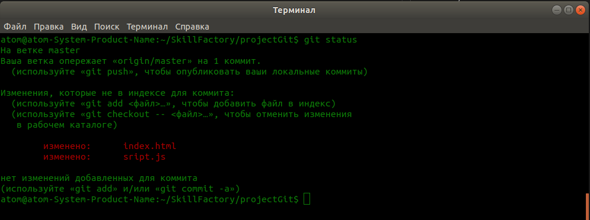

# Изменям файлы проекта и отправляем на GitHub

1. Давайте изменим в нашем проекте файлы **index.html** и **script.js** и далее отправим их на **GitHub**. Изменения могут быть любыми, можете просто добавить пару символов в данные файлы и **Git** сразу зафиксирует изменения.  
2. После внесения изменений проверяем статус при помощь команды `$ git status` и видим следующий результат.  
  
3. Далее сделайте, чтобы эти файлы стали отслеживаться, и сделайте коммит.  
