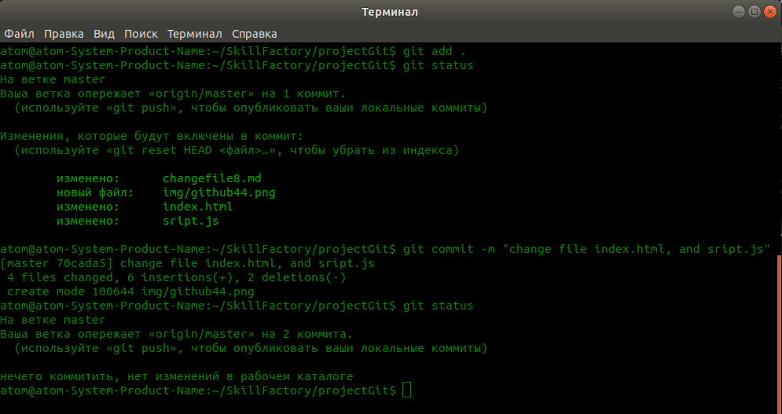
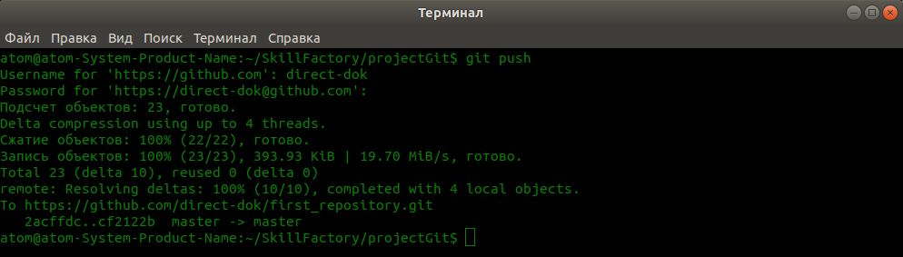

# Изменям файлы проекта и отправляем на GitHub

1. Давайте изменим в нашем проекте файлы **index.html** и **script.js** и далее отправим их на **GitHub**. Изменения могут быть любыми, можете просто добавить пару символов в данные файлы и **Git** сразу зафиксирует изменения.  
2. После внесения изменений проверяем статус при помощь команды `$ git status` и видим следующий результат.  
  
3. Далее сделайте, чтобы эти файлы стали отслеживаться, и сделайте коммит. Результат будет следующий.  
  
4. Чтобы залить наш измененный проект на **GitHub**, нам достаточно выполнить команду `$ git push`. От нас так же потребуется ввести логин и пароль от аккаунта, после чего, файлы будут отправлены на удаленный репозиторий **GitHub**.  
  

[Заливаем проект на GitHub](gitHub7.md "Нажмите, чтобы перейти в предыдущей главе") <---> [Как получить файлы с GitHub](getFile9.md "Нажмите, чтобы перейти к следующей части")

[Назад к оглавлению](readme.md "Нажмите, чтобы перейти к содержанию")