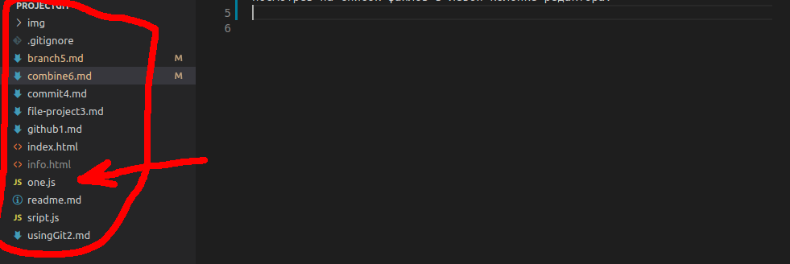
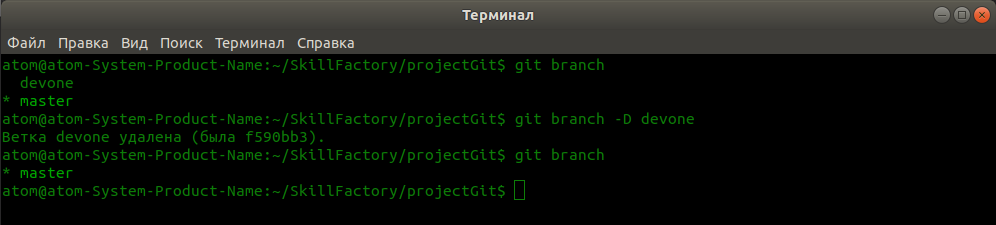

# Объединение веток проекта

1. На данный момент мы знаем, что у нас есть две ветки, это **devone** и ветка **master**. Также мы знаем, что в данных ветках, свои изменения, а также есть файлы, которых нет в другой ветке и сейчас мы будем совмещать данные ветки.  
2. Чтобы совместит ветки, воспользуйтесь командой `$ git merge devone`. Но сперва убедитесь, что Вы находитесь в ветке **master**, и если это так, то выполняйте команду `$ git merge devone`, она совместит ветку **master** с веткой **devone** и объединим две ветки проекта. Убедиться в этом, мы можем посмотрев на список файлов в левой колонке редактора.  
   
Как видим в ветке **master**, теперь присутствует файл **one.js**, который ранее был только в ветке **devone**. Так можно объединять ветки, но порой случаются конфликты, которые нужно будет решать.  
3. Давайте удалим ветку **devone**, так как она нам больше не нужна. Выполним команду `$ git branche -D devone`, после чего, выполним команду `$ git branch` и получим следующий результат.  
  
Как видим, ветка **devone** удалена, ее больше нет.  

[Как пользоваться ветками в проекте и для чего они нужны](branch5.md "Нажмите, чтобы перейти в предыдущей главе") <---> [Заливаем проект на GitHub](gitHub7.md "Нажмите, чтобы перейти к следующей части")