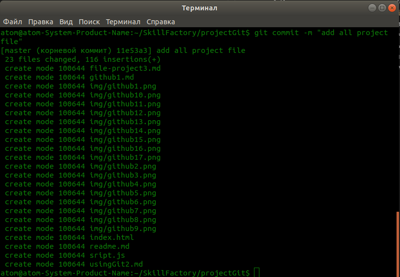
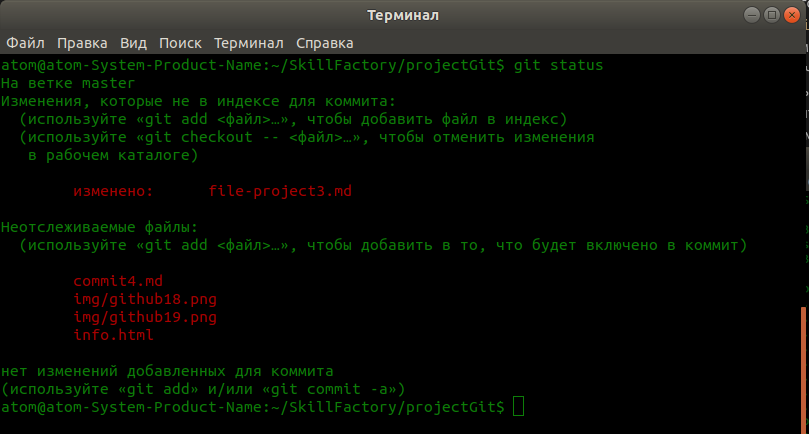
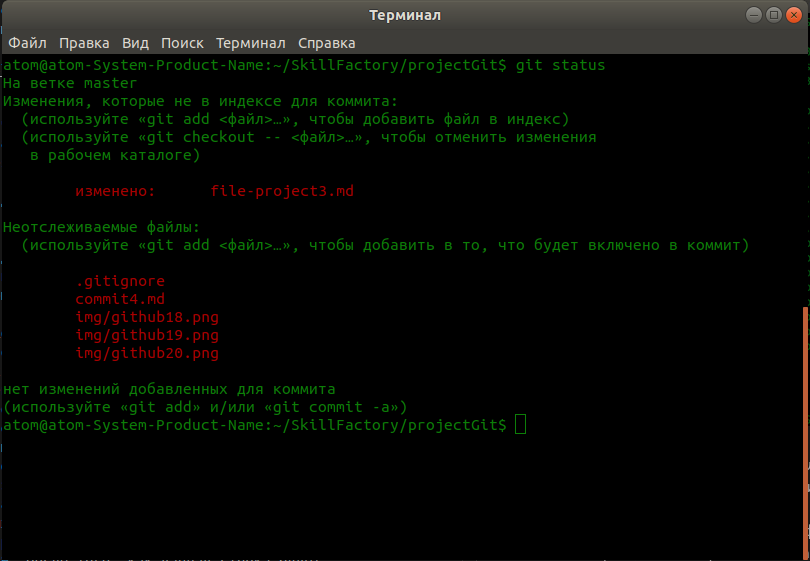
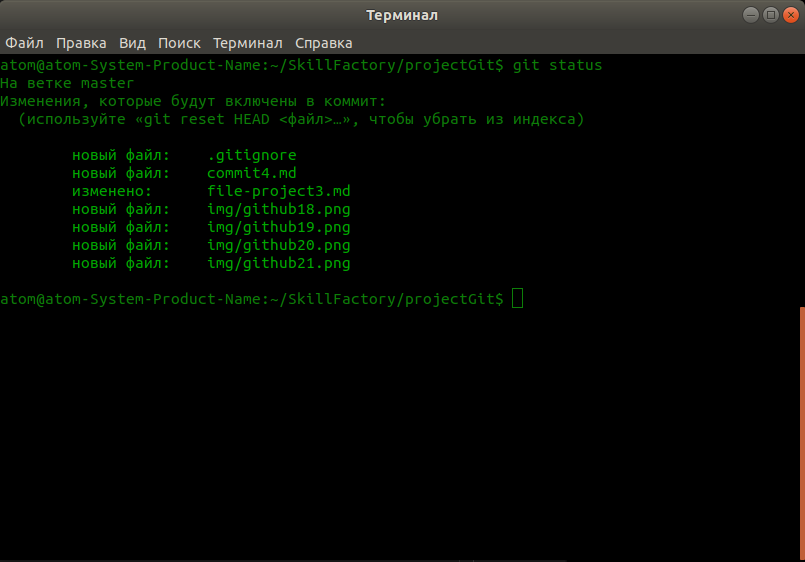
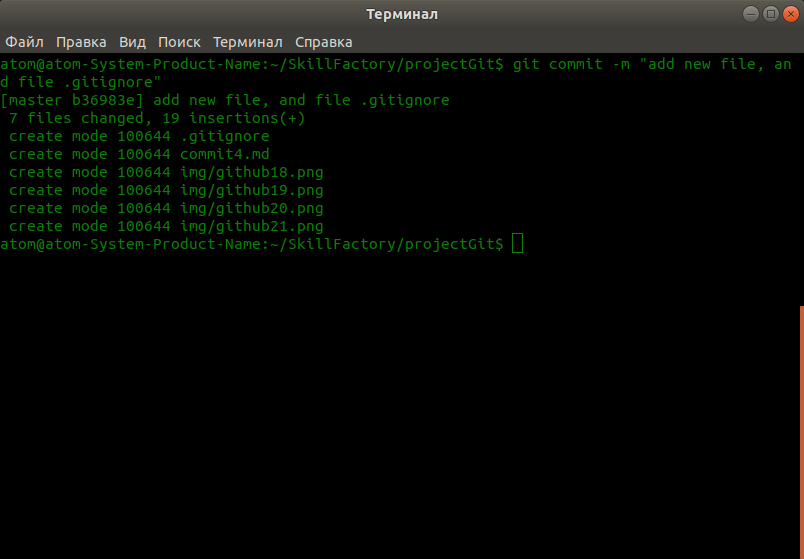

# Делаем коммит, отправляем файлы проекта на GitHub и игнорируем файлы

1. И так, пришло время нашего первого коммита. Для этого, выполняем следующую команду `$ git commit -m "add all project file"`. Сразу обращаю внимание, что команда выглядит так `$ git commit -m ""`, а в ковычках, мы пишем название данного коммита, к примеру Вы можете описать, что Вы добавили в проект, что изменили, или удалили. Сообщение в кавычках, будет отразать суть данного коммита, и Вы далее посмотрев сообщение о коммите, будете знать, к какой версии проекта можно откатиться, если что-то пойдет не так. Выполните вышеприведенную команду с Вашим сообщением. Результат будет следующим.  
  
2. Мы подготовили файлы к отправке, но прежде чем отправлять их на **GitHub**, давайте я расскажу, что делать, если в проекте есть файлы, которые мы не хотим отправлять на **GitHub**. Мы будем игнорировать такие файлы автоматически, чтобы постоянно не исключать их из списка отслеживаемых вручную.  
3. Давайте в корне проекта создадим файл **info.html**, который мы не хотим отслеживать и внесем в этот файл, какой то произвольных **html** код. Допустим, что этот файл, будет в проекте выводить какой то список возникающих ошибок и ни кому из других разработчиков, знать об этом файле просто не зачем, так как мы его используем только для наших целей, поэтому мы не хотим, чтобы данный файл был отправлен на **GitHub** и мы будем его игнорировать.  
4. После создания файла введем команду `$ git status` и увидим, что Git знает о вновь созданном файле, но не отслеживает его.  
  
Как видим, в моем списке есть неотслеживаемые (новые) файлы, среди которых есть **info.html**, который мы не хотим ослеживать, прежде чем сделать `$ git add .`, мы добавим специальный файл, который нам очень поможет.  
5. Мы не хотим, чтобы файл **info.html**, попадал в наши коммиты и был отправлен на **GitHub** и чтобы это сделать, мы создаем в корне проекта файл **.gitignore**, в котором задаем правила, позволяющие не допускать добавления в коммит, определенных файлов. В файле **.gitignore** пишем следующее правило `info.html`, просто добавляем эту строку, что бы заигнорировать файл **info.html**. После того, как данная строка будет добавлена в файл **.gitignore**, файл **info.html** будет игнорироваться при выполнении команды `$ git add .` и не будет добавляться в коммит.  
6. Выполняем команду `$ git status` и видим, что файл **info.html**, больше не отображается ни в одном из списков.  
  
Так как имя файла **info.html**, указано в файле **.gitignore**, он будет автоматически игнорироваться и исключаться из коммитов. Именно так, нам нужно поступать со всеми файлами, которые мы хотим исключить из коммитов. Можно исключать как отдельные файлы, папки и файлы по расширению и другие правила. Подробнее о синтаксисе, Вы сможете прочитать воспользовавшись поиском в гугл, информации по этому вопросу достаточно.  
7. Сам файл **.gitignore**, мы добавляем в коммит, для чего выполняем известную нам команду `$ git add .` и получаем следующий результат.  
  
Как видим среди файлов есть файл **.gitignore**.  
8. Помните, что после изменения в файлах, прежде чем отправлять их на **GitHub**, нужно выполнять команду `$ git add .`, чтобы включать все измененные и новые файлы в коммит.  
9. Давайте сделаем еще один коммит и в нем расскажем, что мы добавили к проекту новые файлы в том числе файл **.gitignore**. Выполним команду `$ git commit -m "add new file, and file .gitignore"` и получим следующий результат  
  
Выполняем следом команду `$ git status` и видим, что на данный момент, комитить нечего, результат будет следующим  

