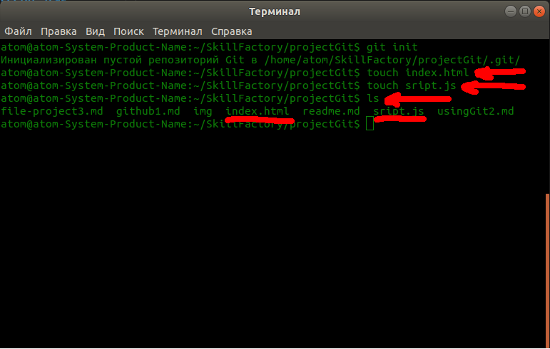
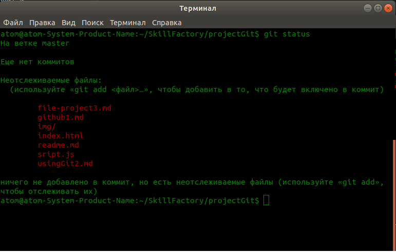
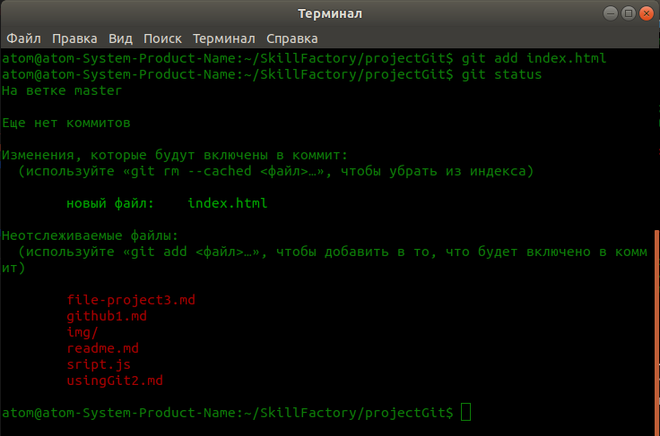
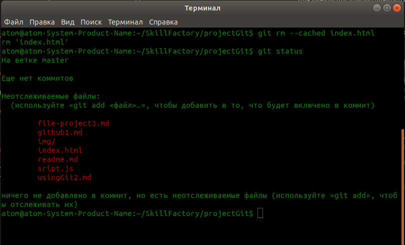
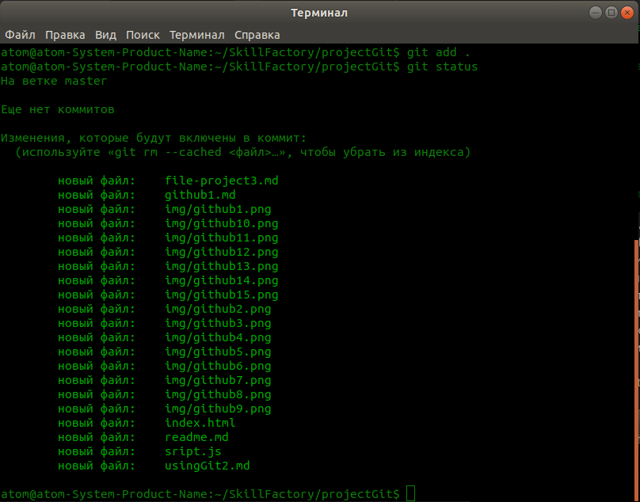
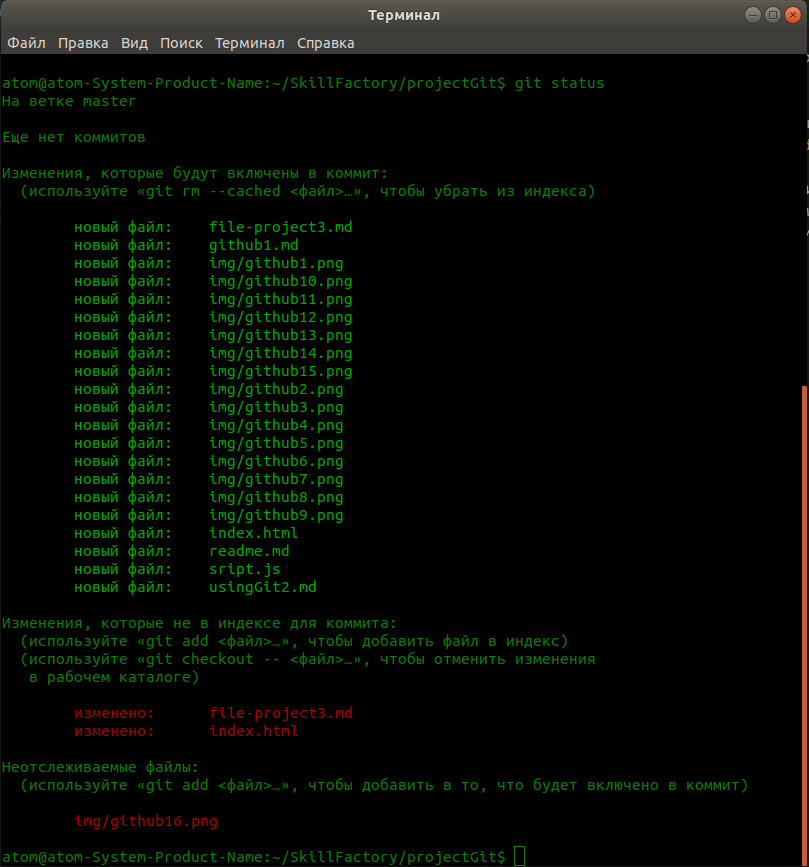
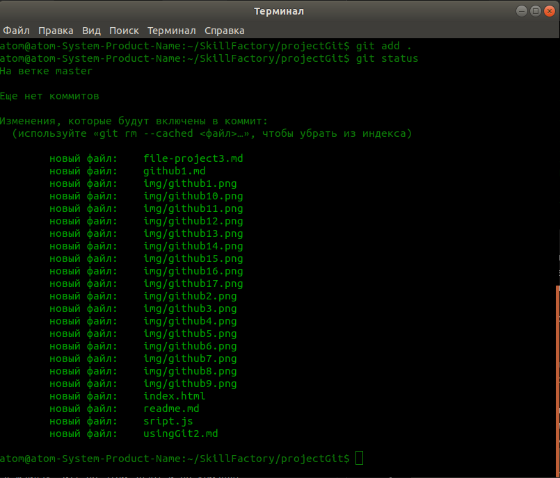

# Создаем файлы проекта. Первый коммит

1. Создайте в папке проекта файл **index.html** (с HTML структурой) и **script.js**  
  
2. Далее воспользуемся базовой командой Git, которая нам поможет понять, что происходит на данный момент в проекте, это следующая команда  
`$ git status`  
  В терминале мы видим файлы и папки подсвеченные красным цветом. Это означает, что система git, еще их не отслеживает и нам нужно их добавить, чтобы начать следить за изменениями в данных файлах.    
Так же, в терминале вывелась информация о том, что мы находимся в ветке master, у нас еще нет комитов и есть неотслеживаемые файлы, которые еще не добавлены в комит.    
О ветках немного позже, но скажу вкратце, что веток может быть намного больше чем одна и мы можем ими пользоваться. Ветки напоминают древовидную структуру, по которой мы можем перемещаться. Каждая ветка, это версия проекта и по идее сколько веток, столько и версий проекта. Эти версии мы можем в дальнейшем совмещать и получать определенный результат.  
3. Команда `$git add`, позволяет указать файлы проекта, которые нужно отслеживать. И сейчас мы рассмотрим, как ей пользоваться.  
Для начала предлагаю начать отслеживать файл **index.html**. Для этого введем в терминале следующую команду:  
`$ git add index.html`  
После чего, для проверки состояния нашего проекта, нам нужно ввести команду, которую мы с Вами уже изучили  
`$ git status`  
  
Обратите внимание, что мы добавили файл index.html, после чего проверили статус и видим, что появился новый файл index.html, который теперь подсвечивается зеленым цветом, это значит, что файл index.html, теперь отслеживается и все изменения в нем так же будут отслеживаться. Файлы помеченные красным, по прежнему не отслеживаются.  
Файлы которые не отслеживаются, можно добавить по очереди, командой `$ git add`, но есть способ, добавить в отслеживание все файлы и папки в проекте, но об этом позже.  
4. Обратите внимание, что файл можно как добавить, так и убрать из списка отслеживаемых, команду для этого, можно найти в терминале в предыдущем скриншоте. Для того, что бы убрать файл из списка отслеживаемых, нам нужно в терминале выполнить команду:  
`$ git rm --cached index.html` и далее, чтобы проверить результат выполняем команду `git status`, и получаем следующий результат:  
  
Как видим, нет отслеживаемых файлов, файл index.html, вновь присоединился к списку неотслеживаемых файлов и стал красного цвета.  
5. Как начать отслеживать все файлы? Для этого нужно выполнить команду `$ git add`, но в конце команды, нужно добавить точку. Это должно выглядеть следующим образом:
`$ git add .`, выполните эту команду и следом выполните `$ git status` и вы удвидите следующий результат  
  
Как видим после исполнения команды `$ git add .` с точкой, в список отслеживаемых попали все файлы проекта, включая файлы находящиеся в папках. Команда с точной, выполняется рекурсивно по всему проекту, начиная следить за всеми файлами в проекте.  
Скажу так, что обычно, **Git** не используют для работы с изображениями, но так как у нас тестовый проект, то мы добавляем все файлы подряд и смотрим, что получится. В дальнейшем, когда будете работать с реальными проектами, изображения лучше игнорировать и не отслеживать. В **Git** есть возможность запретить отслеживать файлы находящиеся в определенных папках, запретить отслеживать файлы с определенными названиями и расширениями, для этого нужен файл **.gitignore**, в котором прописываются файлы, которые не нужно отслеживать и при выполнении команды `$ git add .`, файлы попадающие под правила описанные в файле **.gitignore**, не будут включены в коммит. Об этом я обязательно расскажу далее.  
6. Предлагаю посмотреть, как происходит отслеживание. Давайте возьмем файл index.html, и изменим его, допустим добавим в код следующую строку `<h1>Изучаем Git</h1>`. После чего, проверим изменения, введя команду `$ git status`. Давайте посмотрим, что получится.  
  
Из результата выполнения команды у меня следующие результаты. После добавления всех файлов в список отслеживаемых, у меня были изменены два файла, index.html и file-project.md, так же было добавлено новое изображение github16.png, все эти файлы отмечены красным цветом и к ним есть комментарии, думаю Вы разберетесь, что и где.  
Файлы в которых были произведены изменения, не находятся в индексе коммита и чтобы их вновь добавить, нужно вновь выполнить команду `$ git add .`, после чего, изменения в файлах будут добавлены в индекс коммита.  
Теперь Вы немного понимаете как работает Git. Как видите, если мы производим какие то изменения в файлах, Git об этом знает и по команде, может сообщить нам об этом, а мы далее, должны действовать так, как нам это необходимо и выполнить нужные нам задачи.  
7. Давайте вновь добавим измененния в индекс коммита введя команду `$ git add .` и `$ git status`. Смотрим результат.  
  
Как видим, ничего не помечено красным, а это значит, что все файлы на данный момент добавлены в индекс коммита, до очередного изменеия в каком то из файлов, или пока не будет добавлен новый файл.  

[С чего начать](usingGit2.md "Нажмите, чтобы перейти в предыдущей главе") <---> [Делаем коммит и игнорируем файлы](commit4.md "Нажмите, чтобы перейти к следующей части")

[Назад к оглавлению](readme.md "Нажмите, чтобы перейти к содержанию")