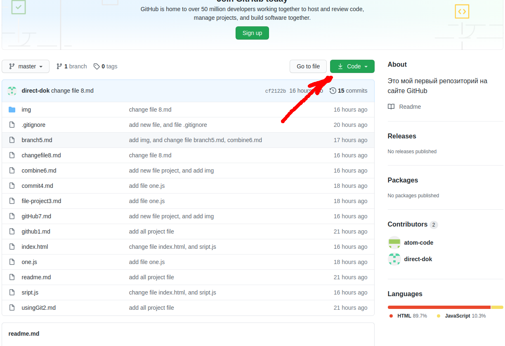
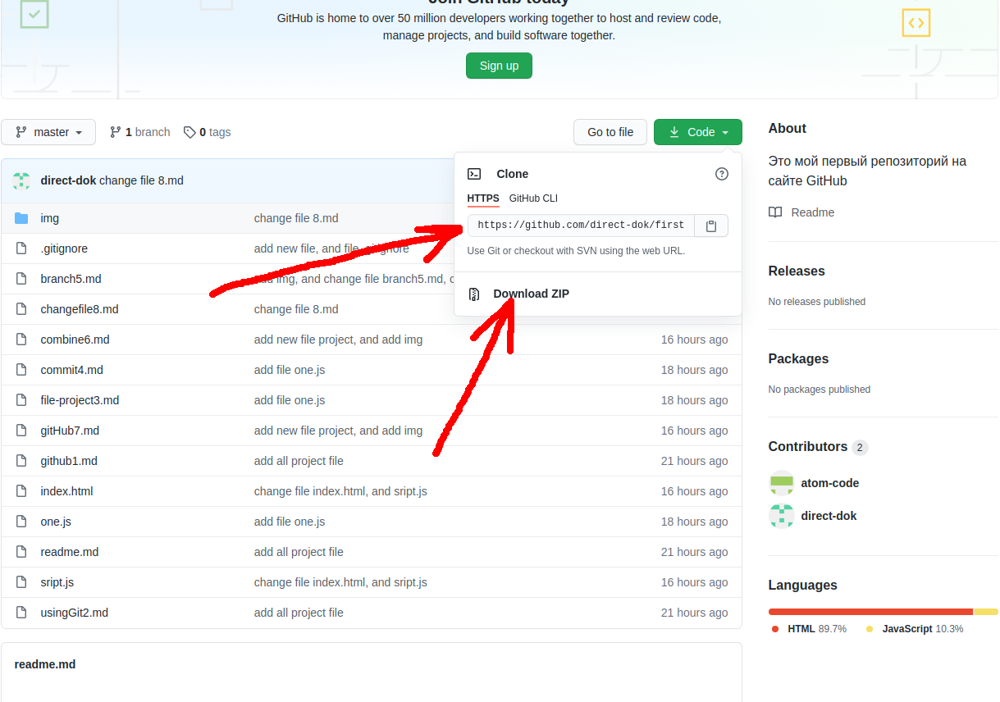
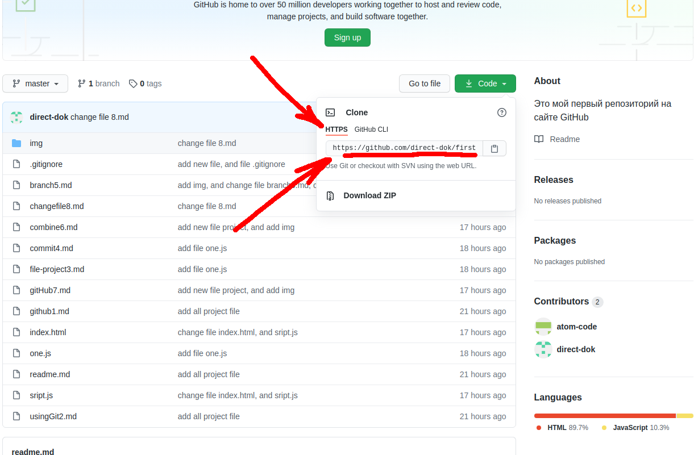
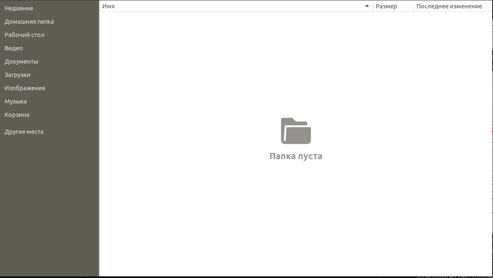
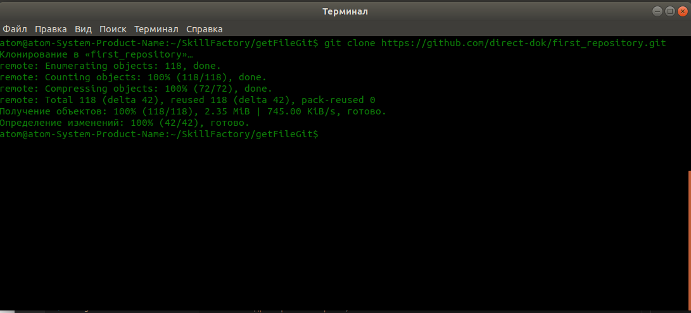
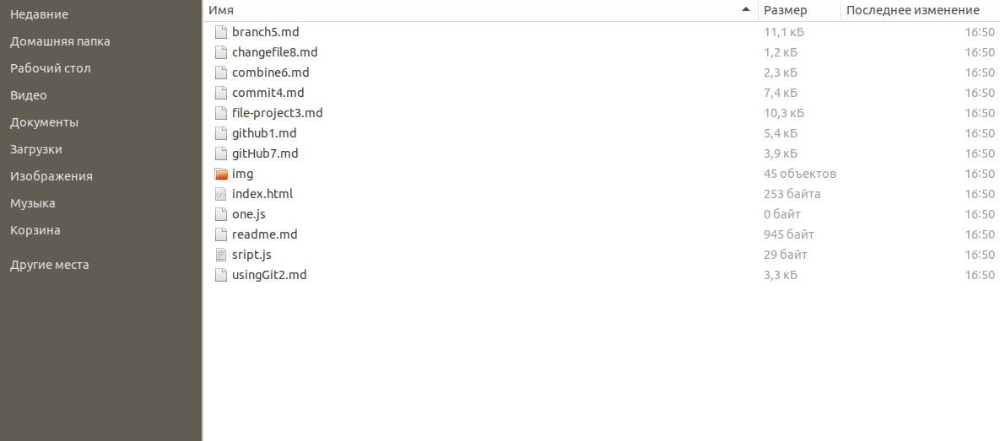

# Как нам получить файлы с удаленного репозитория GitHub 

1. Порой нам нужно получить файлы с удаленного репозитория расположенного на GitHub. Такая задача может возникнуть в случае, если Вы присоединяетесь к разработке какого то проекта. Получить файлы можно несколькими способами.  
2. Смотрим, что же содержит репозиторий. Найдите зеленую кнопку с надписью **Code**, расположенную справа. Кнопка показана на скриншоте.  
   
Нажмите на эту кнопку и сразу появится выпадающее меню, где на выбор, Вы можете скачать файлы проекта в .zip архиве, по https, SSH, или Git CLI.  
  
3. Да, мы можем скачать файлы проекта в .zip архиве, далее сохранить на нашем компьтере, распаковать и далее приступить к разработке. Но мы можем получить файлы выполнив команду `$ git clone путь до репозитория`. Путь до репозитория можно найти, нажав на зеленую кнопку **Code**, и в выпадающем меню на вкладке **HTTPS** скопируйте **URL** адрес, в моем случае он будет таким **https://github.com/direct-dok/first_repository.git**. Ниже показано, откуда брать адрес.  
  
4. Далее создаем на компьтере новую папку, в которую мы при помощи команды скачаем файлы проекта с GitHub, и при помощи команды `$ cd /путь до папки/` перейдем через терминал во вновь созданную папку, и когда Вы перешли в нее, выполните команду `$ git clone путь до репозитория`. В моем случае, команда будет выглядеть следующим образом `$ git clone https://github.com/direct-dok/first_repository.git`.  
До выполнения команды, папка пустая.  
  
Выполняем команду в терминале, для получения файлов проекта из удаленного репозитория.  
  
Видим, что файлы были получены и теперь проект находится в созданной ранее папке.  

5. Как мы видим, при помощи всего одной команды, мы склонировали файлы проекта и можем приступать к разработке. Это очень удобно и я Вам советую пользоваться этой возможностью регулярно.  

<<< [Изменям файлы проекта и отправляем на GitHub](changefile8.md "Нажмите, чтобы перейти в предыдущей главе") <---> [Вносим изменения в проект и получаем обновления с GitHub](gitpull10.md "Нажмите, чтобы перейти к следующей части") >>>

<<< [Назад к оглавлению](readme.md "Нажмите, чтобы перейти к содержанию")
