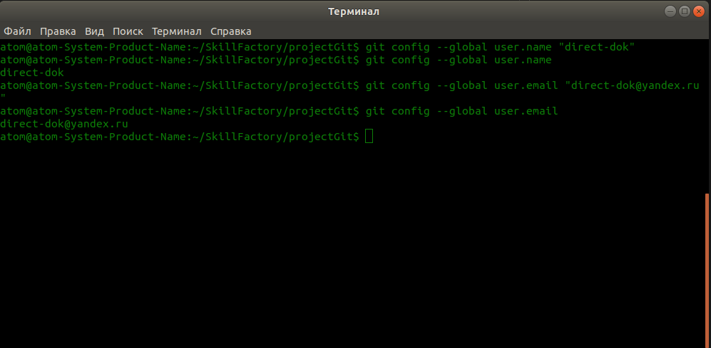
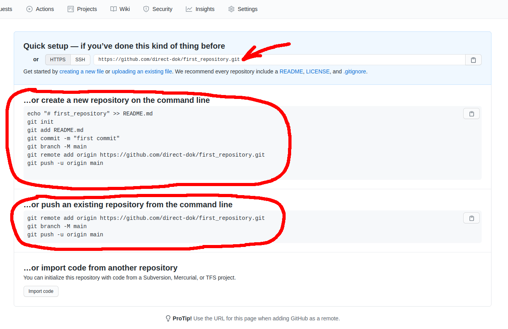
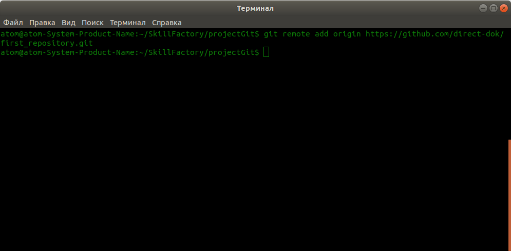
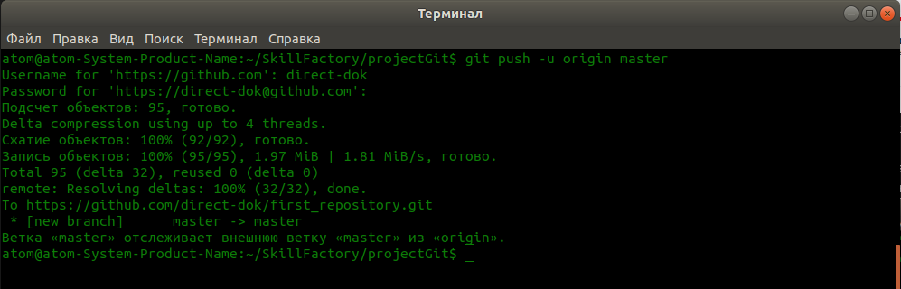
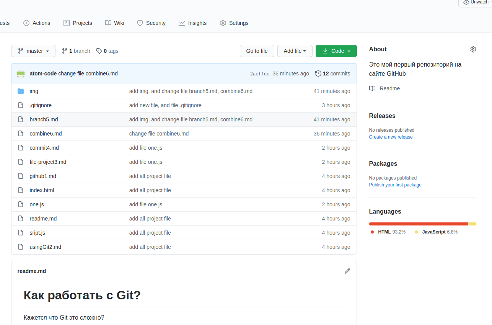

# Заливаем проект на GitHub

1. Мы уже регистрировались на **GitHub**, и у нас есть все данные для работы с ним. У нас должен быть аккаунт на **GitHub**, а также дожен быть создан репозиторий, куда мы и будем отправлять наши файлы.  
2. Вы должны знать Ваш логин и пароль от **GitHub**, чтобы отправлять файлы через консоль.  
3. Далее нам нужно заполнить наше логин на **GitHub** и адрес электронной почты, указанный при регистрации на **GitHub**. Логин мы устанавливаем командой `$ git config --global user.name "direct-dok"`, а адрес электронной почты, командой `$ git config --global user.email "direct-dok@yandex.ru"`.  
Выполните эти команды и укажите Ваши данные, они будут использоваться, в процессе отправки файлов на **GitHub**.  
  
4. Переходим на сайте **GitHub** в наш ранее созданный репозиторий и видим следующее  
  
5. Из приведенных команд, нас команда `$ git remote add origin https://github.com/direct-dok/first_repository.git`, так как именно данной командой, мы добавляем адрес удаленного репозитория на **GitHub**, на который мы отправим наш проект.  
Выполним эту команду в терминале.  
  
6. Чтобы залить наш проект в репозиторий по ранее добавленному адресу, нам нужно выполнить следующую команду `$ git push -u origin master`. После выполнения данной команды, начнется отправка файлов нашего проекта на удаленный репозиторий. Может потребоваться ввести логин и пароль от аккаунта на **GitHub**. В моем случае, это потребовалось.  
Вот как выглядит процесс отправки файлов проекта на удаленный репозиторий.  
  
7. Переходим в наш репозиторий на **GitHub** и видим, что все отправленные файлы, успешно залиты в репозиторий.  

В следующем уроке, мы изменим файлы в проекте, и отправим обновленный проект на **GitHub**.  

[Объединение веток проекта](combine6.md "Нажмите, чтобы перейти в предыдущей главе") <---> [Изменям файлы проекта и отправляем на GitHub](changefile8.md "Нажмите, чтобы перейти к следующей части")

[Назад к оглавлению](readme.md "Нажмите, чтобы перейти к содержанию")