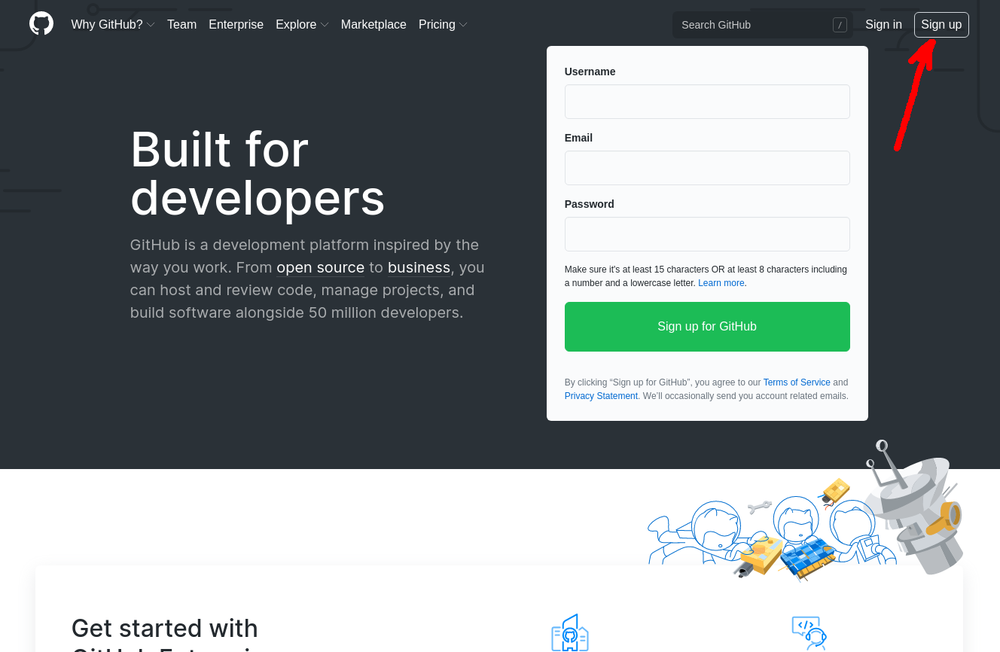
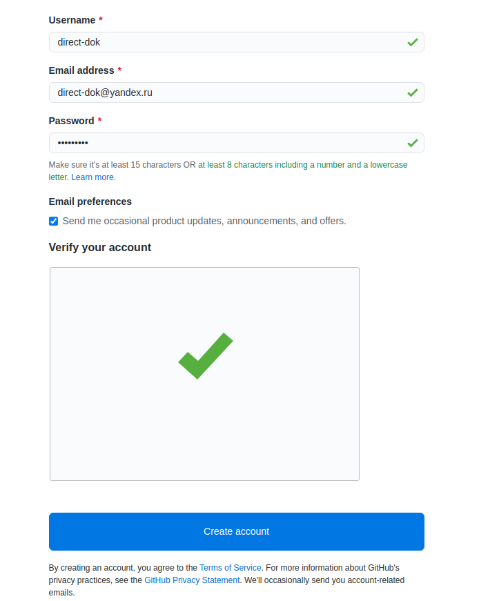
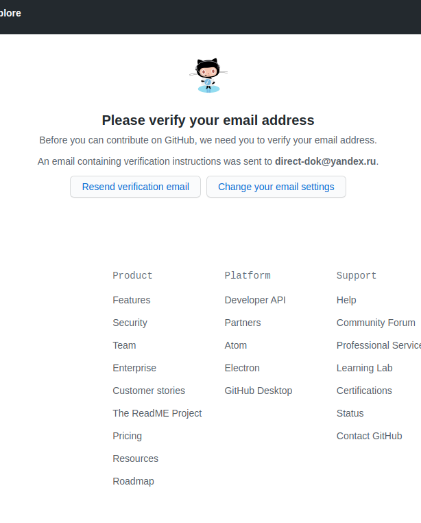
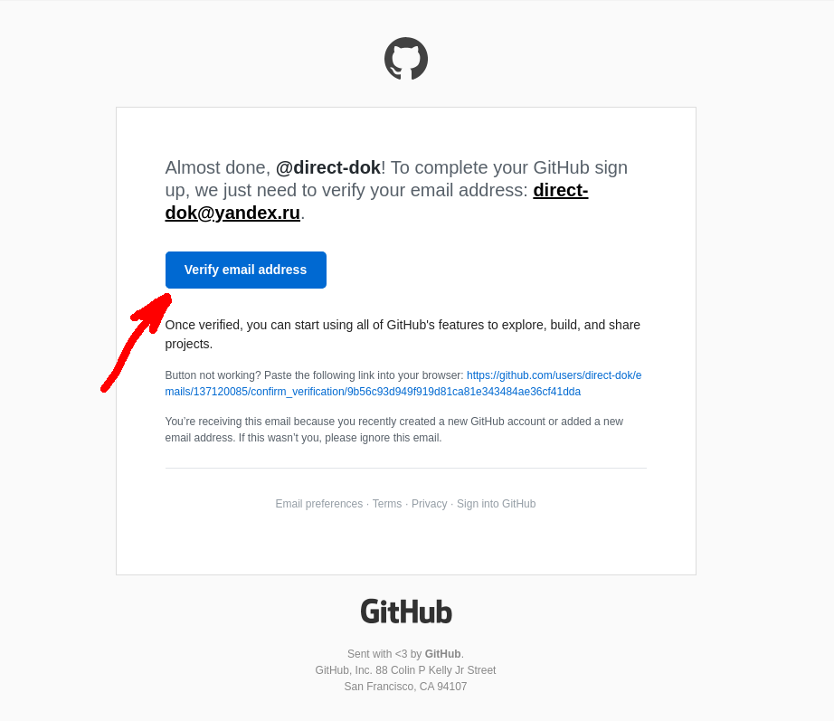
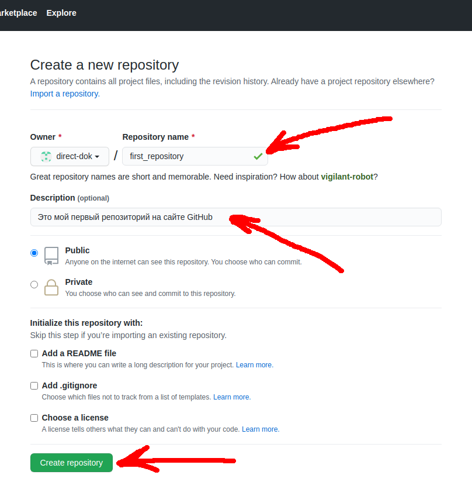

[Назад к оглавлению](readme.md "Нажмите, чтобы перейти к содержанию")

# Регистрация на GitHub

1. Переходим на сайт *[GitHub](https://github.com)*
2. Нажимаем на кнопку **Sign Up**, как показано на изображении ниже  

3. Заполните форму как показано на изображении ниже и выполните проверочное антиспам задание. Далее нажимаем на синюю кнопку **Create Account**, как показано на изображении ниже  

4. После нажатия синей кнопки **Create Account**, Вы увидите страницу приветствия. Она выглядит как показано на изображении ниже. На этой странице, Вам нужно отметить, чем Вы интересуетесь. Отмечайте и переходите к следующему пункту  

5. На этом шаге, нужно подтвердить Ваш e-mail адрес, указанный Вами при регистрации. Зайдите в Вашу почту и перейдите по ссылке, указанной в письме с сайта **GitHub**  
  
На почту должно прийти письмо, со следующим содержимым. Нажмите на кнопку, **Verify email adress** и подтвердите, Вашу почту

6. После подтверждения адреса электронной почты, Вас направит на форму входа на сайт. Введите в нее Ваш e-mail, и пароль указанный при регистрации  
7. После входа, Вас направит на следующую страницу. Выберите на ней **Create a repository** (создать репозиторий)  
  
8. Далее Вас перебросит на страницу, где Вы заполните необходимые поля и после нажатия на кнопку **Create Repository**, создадите свой первый репозиторий, где в дальнейшем мы с Вами разместим наш первый проект  
  
Отмечать чекбоксы перед кнопкой или нет, думаю разберетесь сами, это лишь настройки и если их не отметить, ничего Вы не потеряете. Будете пользоваться этими настройками, когда разберетесь получше  
9. После создания репозитория, Вы будете перенаправлены на страницу, где будут указаны базовые команды, при помощи которых, Вы сможете сделать Ваш первый комит и отправить проект на **GitHub**. Обратите внимание на ссылку, на которую указано красной стрелкой, по этому адресу нужно будет отправлять Ваш проект, после чего, он станет доступен в Вашем вновь созданном репозитории  
 
10. И так, мы создали наш первый репозиторий, теперь осталось понять, как начать пользоваться **Git**, сделать первый комит и отправить файлы проекта в наш репозиторий на **GitHub**  

<<< [Назад к оглавлению](readme.md "Нажмите, чтобы перейти к содержанию") <---> [С чего начать?](usingGit2.md "Нажмите, чтобы перейти к следующей части") >>>

<<< [Назад к оглавлению](readme.md "Нажмите, чтобы перейти к содержанию")