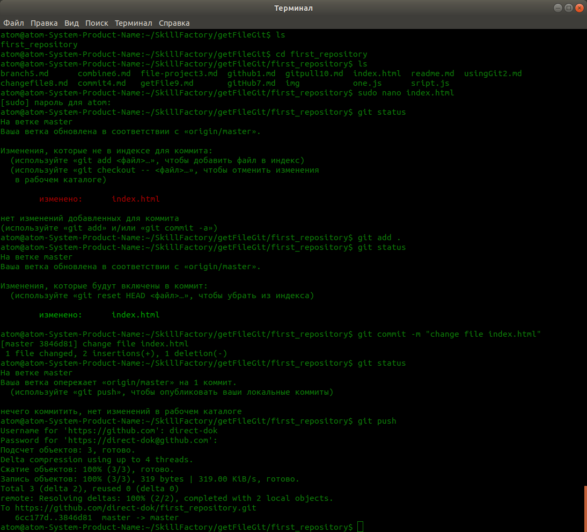
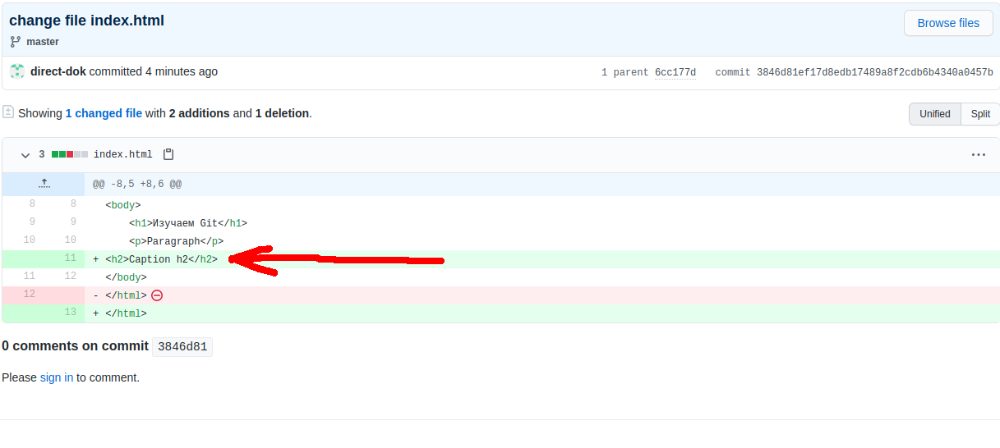
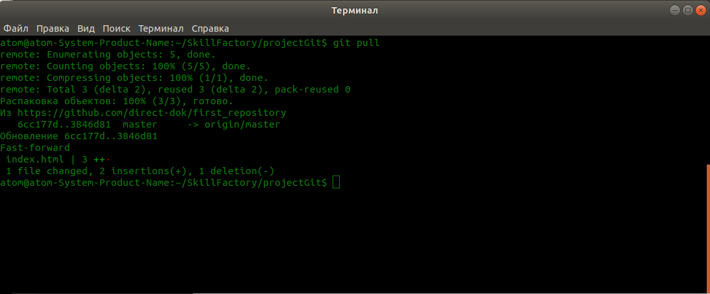

# Вносим изменения в проект и получаем обновления с GitHub

1. В прошлом уроке, мы получили файлы проекта с удаленного репозитория в новую папку. Но мы помним, что у нас есть на компьютере еще одна папка, с тем же проектом, который мы ранее отправляли на **GitHub**. И теперь, если мы внесем изменения в проект в новой папке и далее запушим их в репозиторий на **GitHub**, то у нас на компьютере будет измененная версия проекта в новой папке, и старая версия проекта.  
Давайте смоделируем ситуацию, что мы разрабатывали проект, сделали какую то фичу, закомитили и отправили на **GitHub**. Далее другой разработчик, поработал над проектом и так же закоммитил и отправил на **GitHub**. Получается, что у нас есть версия проекта на компьютере, без внесенных другим разработчиком изменений.  
Золотое правило, перед тем как начать работать с проектом, над которым работает еще несколько разработчиков, нужно получить обновленную версию. А как это сделать, мы сейчас рассмотрим.  
2. Как Вы понимаете, созданием новой папки с проектом, получение в нее файлов проекта, их изменением и отправкой на **GitHub**, мы смоделировали ситуацию, когда один разработчик, внес изменения в проект, которых пока у нас нет и нам прежде чем начать работать над проектом, нужно эти изменения получить.  
3. Давайте для начала, внесем изменения в файл проекта в новой папке, к примеру, давайте в файл **index.html**, добавим строчку `<h2>Caption h2</h2>`. После чего, отправим сделаем коммит, и отправим измененный проект на **GitHub** используя для этого команду `$ git push`. Тем самым мы сымитируем, изменение проекта, вторым разработчиком.  
Все выполненные команды, есть в скриншоте терминила ниже.  

Далее зайдем в наш репозиторий на **GitHub** через браузер и откроем в обновленный файл **index.html**, и увидим, что в нем есть строка `<h2>Caption h2</h2>`, которой нет в нашем проекте, в старой папке.  

4. Теперь давайте перейдем в папку со старым проектом, в котором внесенных изменений нет, в чем мы можем убедиться, открыв файл **index.html** проверим, что строки `<h2>Caption h2</h2>` в нем нет. Далее получим уже измененный проект с **GitHub**, тем самым сымитируя ситуацию, когда второй разработчик внес какие то изменения в код, а нам прежде чем продолжить разработку, нужно получить измененный проект.  
5. Переходим в старую папку с проектом и выполняем следующую команду `$ git pull`, результат выполнения можно видеть на скриншоте ниже.  
  
Далее проверяем файл **index.html** и видим, что строка `<h2>Caption h2</h2>` в нем есть, а это значит, что мы успешно получили обновленный проект и можем приступать к работе над ним. Только после того, как закончим работу, обязательно делаем комит и отправляем изменение на **GitHub**.  

<<< [Как нам получить файлы с удаленного репозитория GitHub](getFile9.md "Нажмите, чтобы перейти в предыдущей главе") <---> [Заключение](conclusion11.md "Нажмите, чтобы перейти к следующей части") >>>

<<< [Назад к оглавлению](readme.md "Нажмите, чтобы перейти к содержанию")