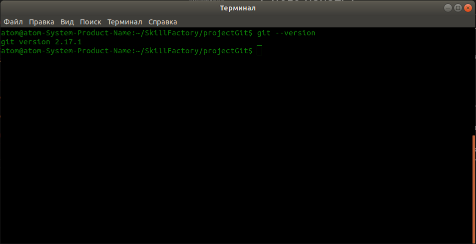
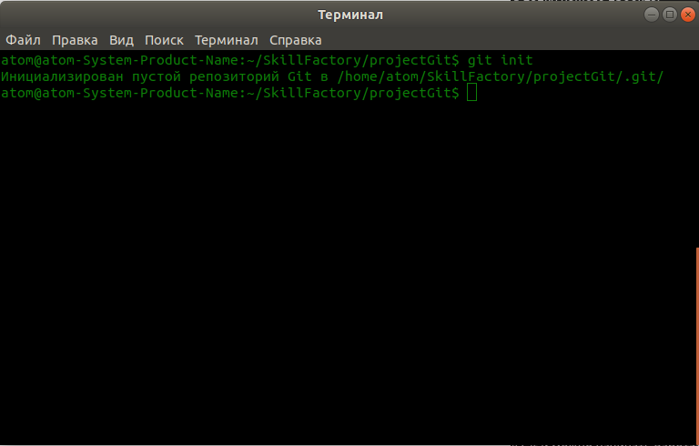
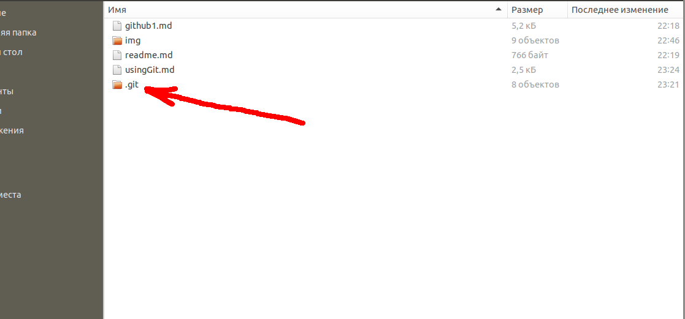

# С чего начать? Устанавливаем Git. Первые команды

[Назад к оглавлению](readme.md "Нажмите, чтобы перейти к содержанию")

У меня операционная система **Linux Ubuntu 18.04**. Я буду работать в ней. **Git** у меня уже установлен, Вам нужно установить **Git** на Ваш компьтер.  

После установки Вам следует открыть терминал и начать выполнять первые команды, следуя руководству ниже.

***

1. Команда для установки на **Git** на **Linux Ubuntu** следующая:  
`$ sudo apt install git`
2. Далее из терминала нам нужно перейти в папку нашего проекта:  
`$ cd /home/user/my-project`  
У каждого свой путь до папки проекта, но знайте, что все команды, нужно выполнять именно в корне папки проекта
3. После установки, можно убедиться, что **Git** установлен, можно командой, которая покажет версию **Git**, установленную на компьютере. Команда следующая  
`$ git --version`  
  
Видно, что в терминале, вывелась версия Git и можно начинать работать  
4. Первым делом, нам нужно проинициализировать репозиторий в папке нашего проета. Напомно, что выше, я предоставлял команду, для перехода в папку проекта из терминала  
`$ cd /home/user/my-project`  
5. Для того, чтобы проинициализировать репозиторий, введите следующую команду 
`$ git init`  
В терминале Вы увидите следующую картину  
  
Также проверьте папку проекта, в ней должна появиться папка **/.git**  
  
Кажется, что ничего не изменилось, но была создана системная папка **/.git**. В данной папке, есть другие папки, где в дальнейшем будет храниться информация из проекта. Мы не будем разбирать этот момент, и перейдем к дальнейшей работе с Git.  

[Регистрация на GitHub](github1.md "Регистрация на GitHub") <---> [Создаем файлы в проекте. Первый комит](file-project3.md "Нажмите, чтобы перейти к следующей части")

[Назад к оглавлению](readme.md "Нажмите, чтобы перейти к содержанию")